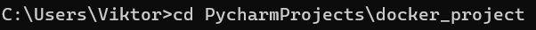
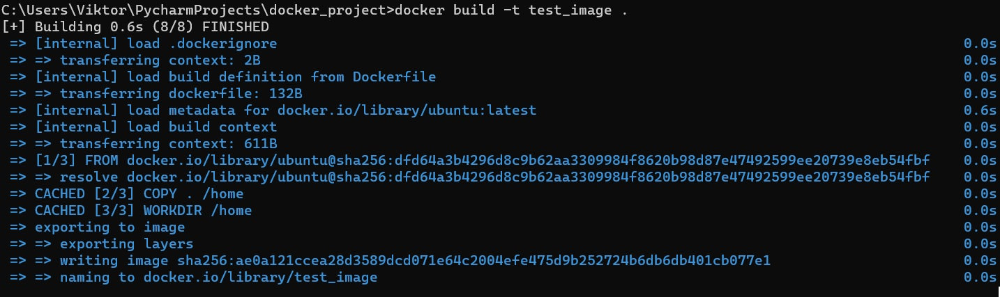
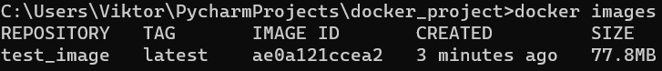
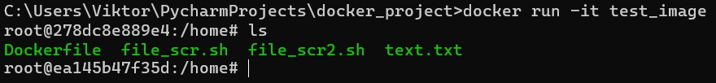
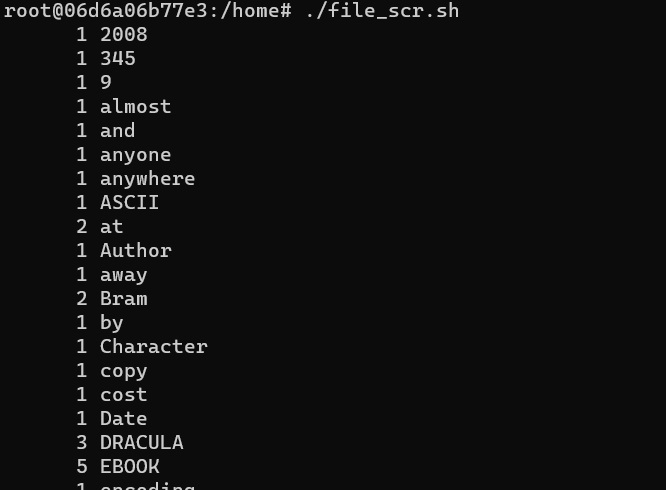
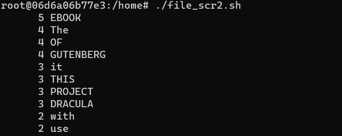

# Пошаговое описание запуска docker контейнера и скриптов в нём

1) Переходим в директорию с docker проектом

[comment]: <> (<tr>)

[comment]: <> (</tr>)

2) По инструкции из Dockerfile создаем образ. Назовем его test_image

[comment]: <> (<tr>)

[comment]: <> (</tr>)

Можно убедиться: образ создан

[comment]: <> (<tr>)

[comment]: <> (</tr>)

3) На основе созданного образа создаем и запускаем контейнер. Чтобы сразу в нем запустить скрипты, можно открыть контейнер в интерактивном режиме (-it). В созданном контейнере, командой ls убеждаемся, что скрипты и текстовый файл на месте 

[comment]: <> (<tr>)

[comment]: <> (</tr>)

4) Запускаем первый скрипт

[comment]: <> (<tr>)

[comment]: <> (</tr>)

5) Запускаем второй скрипт.

[comment]: <> (<tr>)

[comment]: <> (</tr>)

6) Убеждаемся что в той же директории появилось 10 файлов с названиями самых часто встречаемых слов в тексте

[comment]: <> (<tr>)

[comment]: <> (</tr>)

